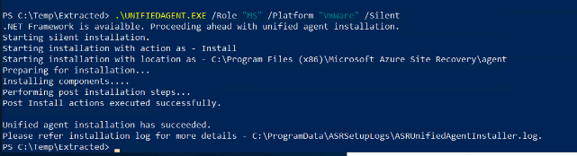
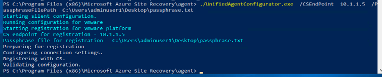

# Migrate Physical Servers to Azure

 

This procedure will show the process to migrate physical servers or other cloud VMs into Azure. It includes the configuration of the Azure Migrate software on a migration server, enrolling servers into replication, test failover and production failover.

 

## **Create an Azure Migrate project:**

- In the target subscription create a new azure migrate project:
-  
-  
-  
-  
- Scroll down to the Migration & Modernization Section and click "Discover"
-  
- Select what type of VM. In this case we choose physical. Make sure the target region is the same as source region.
-  
- Since this is physical, choose "install a replication appliance"
-  

  

## **Install the Migration Appliance Software on the Migration Server**

<https://docs.microsoft.com/en-us/azure/migrate/tutorial-migrate-physical-virtual-machines>

- RDP to the migration server open the "Download" link: <https://aka.ms/unifiedinstaller_eus>
- Choose install the config server and process server. Click next.
-  
- Accept 3rd party license and click next
-  
- Next download the site recovery registration key from the destination azure migrate project in the Azure Portal.
-  
- Browse to the file. Click next.
-  
- Select the direct connect option. Click next.
-  
-  
-  
- For this we are not protecting vmware vms:
-  
-  
-  
-  
- Click install
-  
- Click finish

### **Make sure credentials are stored**

- After the installation completes, the Appliance configuration wizard will be launched automatically (You can also launch the wizard manually by using the cspsconfigtool shortcut that is created on the desktop of the appliance).
- Add account in the first tab called Manage Accounts.
-  

### **Verify the migration server is seen by your migration project:**

- Go back to the Azure Portal target tenant and open Azure migrate. From the left menu under "Migration goals" section, click "Servers, databases and web apps"
-  
- Make sure the project filter is set to your migration project:
-  
- Under "Migration Tools" click "overview"
-  
- From the left menu Click "Infrastructure Servers"
- Look for the connection status of the host you just installed the Replication Appliance Software on.
-  
- If it says connected, you're read to  start replication.

### **Finalize Registration**

- Go to Azure Migrate
- Click "Servers, databases and web apps"
- Under Migration tools, click "Discover"
-  
- It will say deployment complete in the tasks
-  
- It will say Registration finalized:
-  
- Then it will automatically try to discover items. It will say discovery is in progress. This may take a while.
-  

  

## **Install the Mobility service agent on each physical server you want to migrate:**

- Sign into the migration appliance
- Navigate to %ProgramData%\ASR\home\svsystems\pushinstallsvc\repository.
- Find the installer for the machine operating system and version. Review supported operating systems.
- Copy the installer file to the machine you want to migrate.
- Make sure that you have the passphrase that was generated when you deployed the appliance.
  - Store the file in a temporary text file on the machine.
  - You can obtain the passphrase on the migration appliance. From the command line, run **C:\ProgramData\ASR\home\svsystems\bin\genpassphrase.exe -v** to view the current passphrase.
  - Don't regenerate the passphrase. This will break connectivity and you will have to reregister the replication appliance.
- Install on windows via CLI:
  - Extract the contents of installer file to a local folder (for example C:\Temp) on the machine, as follows:
~~~
ren .\Microsoft-ASR\_UA\_9.48.0.0\_Windows\_GA\_21May2022\_Release.exe MobilityServiceInstaller.exe

.\MobilityServiceInstaller.exe /q /x:C:\Temp\Extracted

cd C:\Temp\Extracted
~~~
- Run the Mobility Service Installer
~~~
UnifiedAgent.exe  /Role "MS" /Platform "VmWare" /Silent
~~~
 

- Register the agent with the replication appliance
~~~
cd C:\Program Files (x86)\Microsoft Azure Site Recovery\agent

UnifiedAgentConfigurator.exe  /CSEndPoint <replication appliance IP address> /PassphraseFilePath <Passphrase File Path>

 

UnifiedAgentConfigurator.exe  /CSEndPoint  10.1.1.5  /PassphraseFilePath  C:\Users\adminuser1\Desktop\passphrase.txt
~~~

  

## **Start Replicating Servers**

- From your migration project, in the Migration Tools section
- Click "Replicate"
-  
- Choose "servers or VMs" and "Azure VM". Click continue.
-  
- Fill in the basics questions: (this guide is for "physical or other")
-  
- Select up to 10 servers to migrate:
-  
- Select the target settings
-  
- Select the VM name and VM SKU size
-  
- Select the disk type
-  
- Select the tags, click next
- Click replicate
-  
- If you go into the migration tools overview you will see the server replicating now 
-  

  

## **Test/Pilot Migration**

1. **\*\*Important\*\*** 
   1. Prep the landing zone network for a test/pilot migration by isolating the network. Create an NSG for the target subnet to not allow any inbound and outbound traffic. This will prevent any inbound or outbound traffic that the VM may generate that could potentially interfere with production.
   1. There will be no downtime of customer on-prem servers but make sure to coordinate with the customer for testing activities and submit any change control needed from the customer side.
1. From the Azure Migrate project, click “Overview”
1.  
1. Choose Test Migration
1.  
1. On the 3-dot menu on the left of the VM, select test migration 
1.  
1. Select the destination virtual network to connect the test migration VM to.
1.  
1. Go back to the Server Migration Overview, select Jobs to view the test failover status. 
1.  
1. When it completes, click the job to see the details:
1.  
1. Navigate to the VM resource in the target resource pool. The test VM and associated resources will have a “-test” appended to the name. Make sure the VM is up and running. 
1.  
1. If necessary, have the customer do any verifications needed on their end. You may need to open RDP ports or enable bastion temporarily to complete testing.
1. Test Failover Cleanup:
   1. Navigate back to the Azure Migrate project > Migration Tools > Overview
   1. You should see one “Cleanup pending”. Click the “Perform more test migrations”
   1.  
   1. For the VM that has the status of “Cleanup test failover pending”, click the 3-dot menu on the left. Click the “Cleanup test migration”
   1.  
   1. Check the box for “Testing is complete. Delete the test virtual machine”. Then click “Cleanup Test”
   1.  
   1. To see the status, go back to the jobs section.
   1.  
   1. Cleanup is complete.

  

## **Production Migration**

1. **\*\* Important \*\***  Make sure the scheduled production cutover window was approved by the customer before proceeding.
1. Open the migration project, under Migration tools, click “Migrate”
1.  
1. **\*\* Important \*\***   Make sure the customer has gracefully shut down applications and powered down the server before starting. This is best practice to avoid corruption and sometimes the automated shutdown fails.
1. Select “No” to shutdown machines before migration (since servers should have been gracefully shut down already). Select the VM(s) to failover. Click the “Migrate” button to initiate the migration.
1.  
1. View the status of the failover in the jobs section.
1.  
1. Once completed the status of the replicated machines will show as completed:
1.  
1. Verify the failover completed successfully. 
1. Verify the VMs are powered on in the right networks.
1. Complete the following post-migration tasks.
1. Guest OS owner/App owner post-migration tasks & validations:
   1. Perform any post-migration app tweaks, such as updating host names, database connection strings, and web server configurations.
   1. Perform final application and migration acceptance testing on the migrated application now running in Azure.
   1. Cut over traffic to the migrated Azure VM instance.
1. After customer sign-off on all validations, the following post-migration tasks are needed:
   1. Stop replication. right-click the VM > Stop replication. This does the following: 
      1. Stops replication for the on-premises machine.
      1. Removes the machine from the Replicating servers count in Azure Migrate: Server Migration.
      1. Cleans up replication state information for the machine.
   1. Verify and troubleshoot any Windows activation issues on the Azure VM.
   1. Enable Backups of migrated VMs
   1. Enable ASR replication for migrated VMs
   1. Enable Monitoring for migrated VMs
1. Customer on-prem cleanup
   1. Remove the on-premises VMs from your local VM inventory.
   1. Remove the on-premises VMs from local backups.
   1. Update any internal documentation to show the new location and IP address of the Azure VMs.
1. Production cutover completed.

  

## **Rollback procedure**

If the cutover activity requires a rollback of one or more servers, execute the following steps: 

1. Stop the servers that are being rolled back.
1. Restart the servers in the source environment.
1. Remove the servers from replication through the Recovery Services vault.
1. Remove the servers from Azure.
1. Restart the replication process on the servers.
